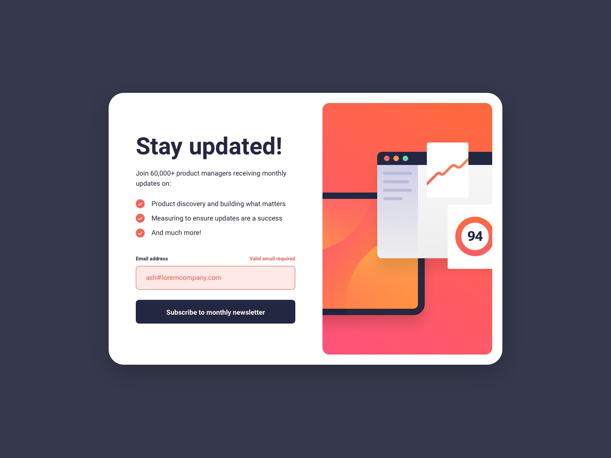

# Frontend Mentor - Newsletter sign-up form with success message solution

Esta é uma solução para o [Newsletter sign-up form with success message challenge on Frontend Mentor](https://www.frontendmentor.io/challenges/newsletter-signup-form-with-success-message-3FC1AZbNrv). 
Os desafios do Frontend Mentor ajudam você a melhorar suas habilidades de codificação criando projetos realistas.

## Layout do projeto em tela de Desktop/Notebook/Tablet/Mobile.


<div align="center">





</div>

## Bem-vindo! 👋

### O que aprendi

Mais uma prática com o HTML, CSS e Js! show 😎

Solução responsive no HTML
```html
      <form class="form" id="form-stay" action="#thanks">
        <div class="div-label">
          <label class="label-input" for="input-email">Email address</label>
        </div>
        <input class="input-email btn" type="email" name="input-email" id="input-email" placeholder="email@company.com">
        <button class="btn-stay btn" type="submit" id="btn-stay">
          Subscribe to monthly newsletter
        </button>
      </form>
```

Adicionando img com pseudo elemento
```css
@font-face {
    font-family: "Roboto";
    src: url(../assets/fonts/Roboto-Regular.ttf);
}

@font-face {
    font-family: "Roboto";
    src: url(../assets/fonts/Roboto-Bold.ttf);
    font-weight: bold;
}
```

Adicionando e Removendo class com click.
```Js
function backgroundImgSignAdd() {
    document.querySelector('.img-sign').style.background = "var(--Tomato)";
};

function backgroundImgSignRemove() {
    document.querySelector('.img-sign').style.background = ""
};
```

### Construído com 🚀

- Marcação semântica HTML5
- Propriedades personalizadas CSS
- Caixa flexível
- Js

## Desenvolvido em: 🚀

<div>
  
  
  
</div>